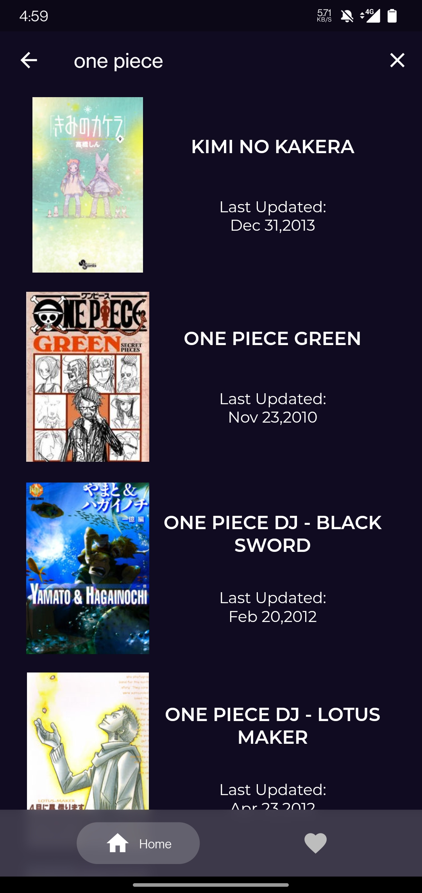
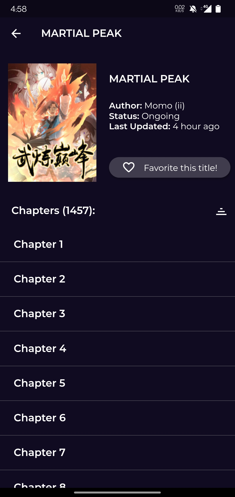

# OtakuFix

An open source Manga reader made with Flutter.

### Screenshots

    

### Releases

The latest release can be found in the [Releases](https://github.com/manakmishra/OtakuFix/releases) tab.
(The app is still work in progress)

### Known Issues

- Favourites screen does not update with the recently favourited Manga sometimes.
- Settings page not yet implemented.

